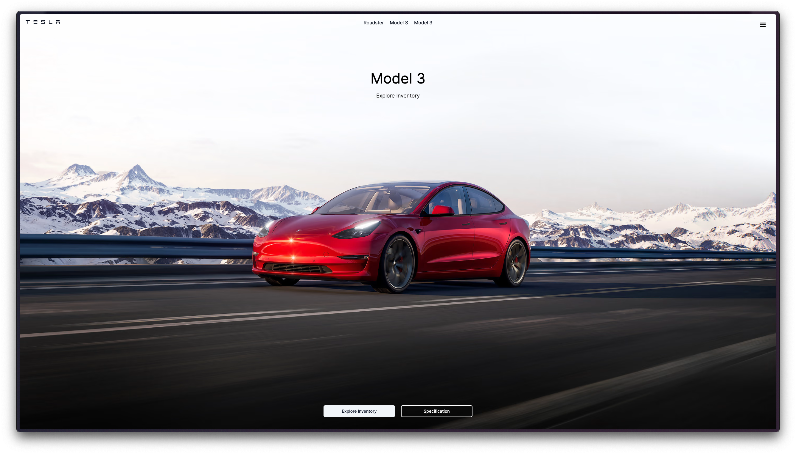
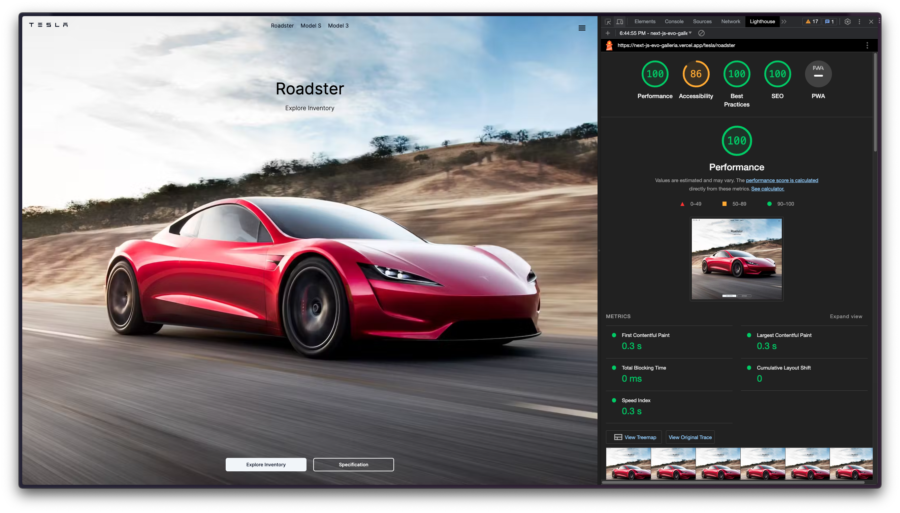

# Evo Galleria



Discover an exceptional of my selected EVs collection.

## Lighthouse Scores



- 🟢 Performance: 100
- 🟠 Accessibility: 86
- 🟢 Best Practices: 100
- 🟢 SEO: 100
- ⚫️ Progressive Web App: N/A

## Demo

View a live demo of the [Evo Galleria](https://next-js-evo-galleria.vercel.app/) prototype version.

## Tech Stack

- [TypeScript](https://www.typescriptlang.org/)
- [Next.JS](https://nextjs.org/)
- [TailwindCSS](https://tailwindcss.com/)
- [RadixUI](https://www.radix-ui.com/)
- [ShadcnUI](https://ui.shadcn.com/)

## Creating a project

```
npx create-next-app@latest

✅ TypeScript
✅ ESLint
✅ TailwindCSS
❌ `src/` directory
✅ App Router
❌ Import alias
```

## Running Locally

Clone this repository :

```bash
> git clone git@github.com:GrungeElFz/NextJS_Evo.Galleria.git

> cd NextJS_Evo.Galleria

> code .

> npm i

> npm run dev
```

> - Open [http://localhost:3000](http://localhost:3000) with your browser to see the result.
>
> - You can start editing the page by modifying `app/page.tsx`. The page auto-updates as you edit the file.
>
> - This project uses [`next/font`](https://nextjs.org/docs/basic-features/font-optimization) to automatically optimize and load Inter, a custom Google Font.

## Learn More

To learn more about Next.JS, take a look at the following resources:

- [Next.JS Documentation](https://nextjs.org/docs) - learn about Next.JS features and API.
- [Learn Next.JS](https://nextjs.org/learn) - an interactive Next.JS tutorial.

## Deploy on Vercel

The easiest way to deploy your Next.js app is to use the [Vercel Platform](https://vercel.com/new?utm_medium=default-template&filter=next.js&utm_source=create-next-app&utm_campaign=create-next-app-readme) from the creators of Next.JS.

Check out our [Next.JS Deployment Documentation](https://nextjs.org/docs/deployment) for more details.
